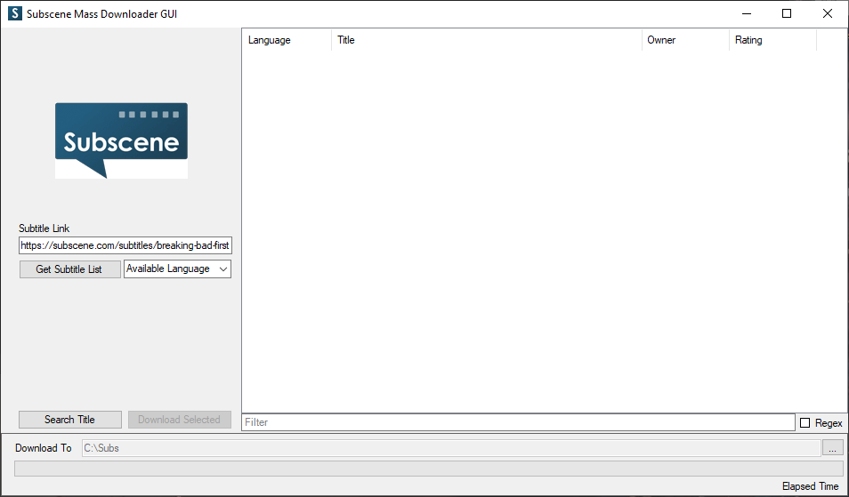
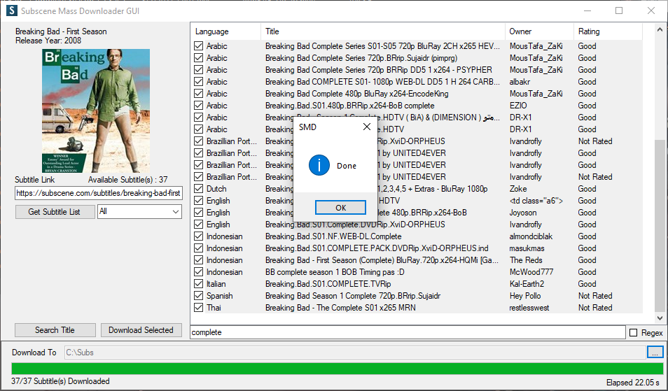

# Subscene Mass Downloader GUI

### Download
 From release [page](https://github.com/LZNOXP/Subscene-Mass-Downloader-GUI/releases/)

### Requirement
- NET Framework 4.7.2

### Preview



### Third Party Library
- [Costura.Fody](https://github.com/Fody/Costura)
- [Ookii.Dialogs.WinForms](https://github.com/ookii-dialogs/ookii-dialogs-winforms) (FolderBrowserDialog)

If you wish to build the project, you might want to install these two from NuGet Package Manager
or simply type ```Update-Package -reinstall``` in the Package Manager Console


### Issue
If somehow [https://subscene.com/](https://subscene.com/) is blocked by your ISP, add these lines to your hosts file located at `C:\Windows\System32\drivers\etc\hosts`

```
104.27.207.92 subscene.com www.subscene.com forum.subscene.com c.subscene.com papi.subscene.com
104.27.206.92 v2.subscene.com u.subscene.com
```

or Try [this application](https://github.com/LZNOXP/Subscene-Mass-Downloader-GUI/releases/download/1.3/Subscene.Unblocker.exe)(This application might be flagged as a virus because it's directly modify the hosts file)
